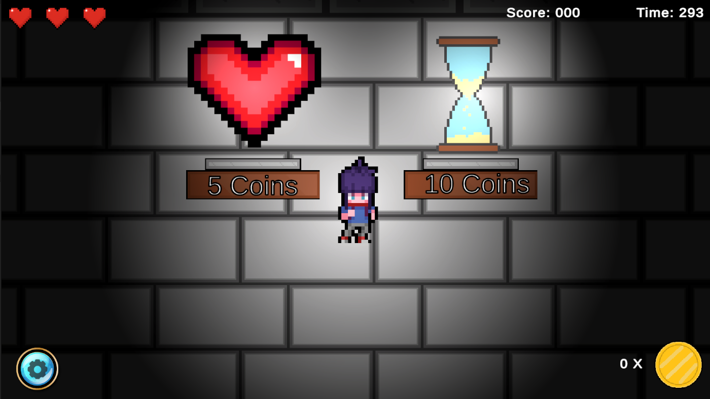

<<<<<<< HEAD
# 🔐 Digital Escape - Educational Puzzle Game

**An immersive quiz-based escape room experience built with Unity and C# to enhance learning through gameplay.**

## 🧠 Overview

**Digital Escape** is a 2D puzzle adventure game designed and built collaboratively with a **small team** of fellow developers. Inspired by educational games and classic dungeon crawlers, it features math and science challenges to unlock paths, while AI-powered monsters chase players using Unity NavMesh.

---

## 🎮 Core Features

- 🧩 **Quiz-Driven Gameplay**: Solve interactive questions to open doors and progress through levels.
- 🧠 **Level-Based System**: Each level introduces new difficulty, mechanics, and concepts for incremental learning.
- 🤖 **AI Monster Behavior**: Enemies use Unity's NavMesh for dynamic patrol and chase logic.
- 🧺 **Item Pickup System**: Collect and use items as part of escape puzzles.
- ✅ **Task Tracking**: Achieved a 92% completion rate across 4 team members with Agile workflow in Jira.
- 📊 **Player Testing**: Refined based on usability feedback from over 20 users, resulting in 37% faster task completion on average.

---

## 👩‍💻 Tech Stack

| 🛠 Technology       | 💡 Description                                                                 |
|--------------------|---------------------------------------------------------------------------------|
| **Unity**          | Game development engine                                                         |
| **C#**             | Main scripting language                                                         |
| **NavMesh + BT + SM** | AI navigation and behavior (NavMesh, Behavior Tree, State Machine)              |
| **Jira**           | Team collaboration and task tracking                                            |
| **Git + GitHub**   | Version control and project collaboration                                       |

---

## 🎮 Gameplay

📽️ **Watch in action**  
Here’s a short demo of how AI works with obstacle in motion:

- **Controls**
  - `WASD` or Arrow keys to move
  - Avoid monsters or you'll restart from checkpoint!

- **Game Flow**
  1. Spawn into a locked room  
  2. Answer math/science questions correctly to unlock doors  
  3. Avoid patrolling monsters  
  4. Reach the final room to escape

---

## 🖼️ Screenshots

| AI Box Monster | Shop Store | Monster and Dead |
|----------------|------------|------------------|
|  |  |  |

---

## 🚀 Getting Started

### Play from Unity Package

1. **Download** [`Digital_Escape.unitypackage`](./Digital_Escape.unitypackage)
2. **Open Unity** (2022.3 or later), create or open a project
3. Go to `Assets > Import Package > Custom Package...`
4. Import `Digital_Escape.unitypackage`
5. In the `Scenes` folder, open the latest scene (e.g., `FinalScene.unity`)
6. Click ▶ to start playing

---

## 📚 Learning Outcome

This project was designed to reinforce problem-solving and STEM learning in a game format. It encourages:
- Logical thinking through puzzles
- Knowledge recall in quizzes
- Adaptation under pressure from AI monsters

---

=======
# 🔐 Digital Escape - Educational Puzzle Game

**An immersive quiz-based escape room experience built with Unity and C# to enhance learning through gameplay.**

## 🧠 Overview

**Digital Escape** is a 2D puzzle adventure game designed and built collaboratively with a **small team** of fellow developers. Inspired by educational games and classic dungeon crawlers, it features math and science challenges to unlock paths, while AI-powered monsters chase players using Unity NavMesh.

---

## 🎮 Core Features

- 🧩 **Quiz-Driven Gameplay**: Solve interactive questions to open doors and progress through levels.
- 🧠 **Level-Based System**: Each level introduces new difficulty, mechanics, and concepts for incremental learning.
- 🤖 **AI Monster Behavior**: Enemies use Unity's NavMesh for dynamic patrol and chase logic.
- 🧺 **Item Pickup System**: Collect and use items as part of escape puzzles.
- ✅ **Task Tracking**: Achieved a 92% completion rate across 4 team members with Agile workflow in Jira.
- 📊 **Player Testing**: Refined based on usability feedback from over 20 users, resulting in 37% faster task completion on average.

---

## 👩‍💻 Tech Stack

| 🛠 Technology       | 💡 Description                                                                 |
|--------------------|---------------------------------------------------------------------------------|
| **Unity**          | Game development engine                                                         |
| **C#**             | Main scripting language                                                         |
| **NavMesh + BT + SM** | AI navigation and behavior (NavMesh, Behavior Tree, State Machine)              |
| **Jira**           | Team collaboration and task tracking                                            |
| **Git + GitHub**   | Version control and project collaboration                                       |

---

## 🎮 Gameplay

📽️ **Watch in action**  
Here’s a short demo of how AI works with obstacle in motion:

- **Controls**
  - `WASD` or Arrow keys to move
  - Avoid monsters or you'll restart from checkpoint!

- **Game Flow**
  1. Spawn into a locked room  
  2. Answer math/science questions correctly to unlock doors  
  3. Avoid patrolling monsters  
  4. Reach the final room to escape

---

## 🖼️ Screenshots

| AI Box Monster | Shop Store | Monster and Dead |
|----------------|------------|------------------|
|  |  |  |

---

## 🚀 Getting Started

### Play from Unity Package

1. **Download** [`Digital_Escape.unitypackage`](./Digital_Escape.unitypackage)
2. **Open Unity** (2022.3 or later), create or open a project
3. Go to `Assets > Import Package > Custom Package...`
4. Import `Digital_Escape.unitypackage`
5. In the `Scenes` folder, open the latest scene (e.g., `FinalScene.unity`)
6. Click ▶ to start playing

---

## 📚 Learning Outcome

This project was designed to reinforce problem-solving and STEM learning in a game format. It encourages:
- Logical thinking through puzzles
- Knowledge recall in quizzes
- Adaptation under pressure from AI monsters

---

>>>>>>> ca02cbffb1f4ca17aae01628ae96df77e037762f
